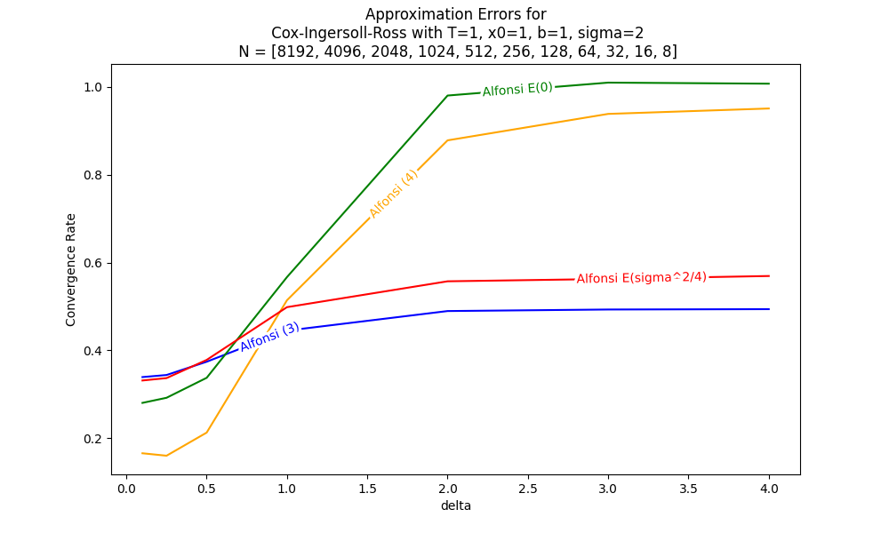

This repo contains the code to simulate SDE's, especially CIR-process, and calculate convergence rates for different approximation methods and parameters.

There are two parts:
- [sde_simulation_demo.ipynb](sde_simulation_demo.ipynb) contains simplified code, which is meant to be more readable and understandable. However, it is not optimized and very slow.
- [sde_simulation_colab.ipynb](sde_simulation_colab.ipynb) and all .py files contains optimized pytorch code with implemented parallelization and gpu acceleration. It also contains more approximation methods. The main script is in [sde_simulation.py](sde_simulation.py) and [sde_simulation_colab.ipynb](sde_simulation_colab.ipynb).

Implemented approximation methods are:
- Euler-Maruyama
- Milstein
- Runge-Kutta 
- Alfonsi Implicit (3) (CIR only)
- Alfonsi Implicit (4) (CIR only)
- Alfonsi Explicit E(lambda) (CIR only)
- Truncated Milstein (CIR only)

Methods and used papers are described in

https://docs.google.com/presentation/d/1LTdMjgigwypS_T-nK8b_EAFDFdt-h7LoQLH1o1R17e0/edit?usp=sharing 

A typical output of the script is like

